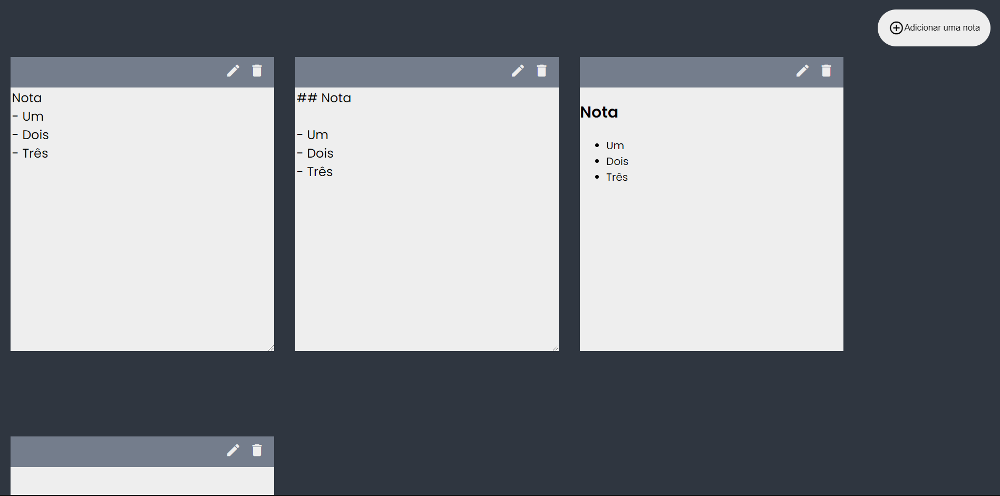

<h1 align="center">
    
</h1>

<h4 align="center"> 
	Notes App
</h4>

<p align="center">
  

  	
  
  <a href="https://github.com/Oppadayo/notes-app/commits/master">
    
  </a>

  
   <a href="https://github.com/Oppadayo/notes-app/stargazers">
    
  </a>
</p>


## 💻 Sobre o projeto

📚 Notes App - é uma aplicação Web feita para criar notas como post-it

O usuário pode:
- Criar notas
- Editar notas
- Excluir notas
 

## 🛠 Tecnologias

As seguintes ferramentas foram usadas na construção do projeto:

- [HTML]
- [CSS]
- [Javascript]

### Pré-requisitos

Antes de começar, você vai precisar ter instalado em sua máquina as seguintes ferramentas:
- Um navegador
- Editor de texto (caso queira mexer no código)

### 🧭 Rodando a aplicação web (Front End)

```bash
# Clone este repositório
$ git clone https://github.com/Oppadayo/notes-app

# Acesse a pasta do projeto no terminal/cmd
$ cd notes-app

# Execute a aplicação em modo de desenvolvimento
$ start chrome index.html``

